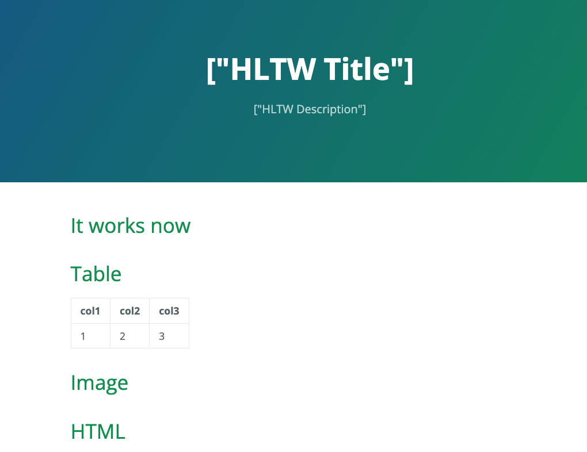

---
#
# Here you can change the text shown in the Home page before the Latest Posts section.
#
# Edit cayman-blog's home layout in _layouts instead if you wanna make some changes
# See: https://jekyllrb.com/docs/themes/#overriding-theme-defaults
#
layout: home
---

# Test

# Table

| col1 | col2      |col3 |  
|------------------|------------|----------------------| 
|1|2|3|

# Image

## Markdown

## HTML

 

# HTML


