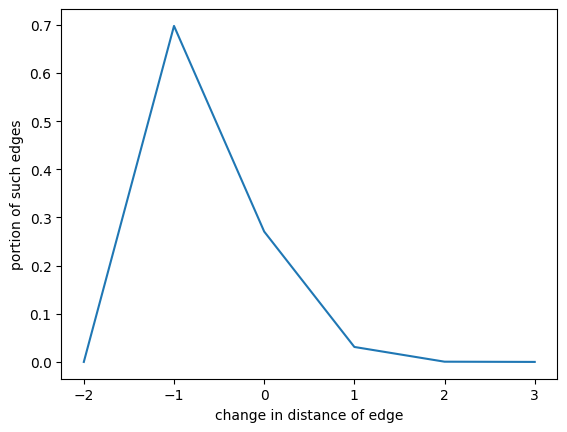

---
#
# Here you can change the text shown in the Home page before the Latest Posts section.
#
# Edit cayman-blog's home layout in _layouts instead if you wanna make some changes
# See: https://jekyllrb.com/docs/themes/#overriding-theme-defaults
#
layout: home
---

> Common knowledge is shared, but people think differently to infer things.

# Introduction

Wikipedia is viewed as storage for an incredible amount of information. However, in reality, it is also a largely connected graph of articles with semantic and contextual similarities. 

An analogy in real life would be Cities and Towns representing articles and blue links in Wikipedia are the roads that connect the cities. There might be cities that are interconnected with highways so that more people can get around the cities in a more direct and faster fashion.  

With Wikipedia alone, we cannot view the traffic on these roads, since we have no knowledge of how people hop from one idea to another. That’s where the Wikispeedia dataset comes in.

Wikispeedia is an online game where players have to reach the target wiki article from an unrelated start wiki article by clicking links in the articles, where the human-clicked links can be considered as the traffic between cities. The path taken is recorded during the gameplay, which is the main subject of our analysis! 

Let’s view people's connections in the Wikispeedia game as trips between cities and towns, and start the discovery journey!

## How are the knowledge cities connected together?

There are some cities that have a lot of roads connected to them, this is the idea of the hub on the graph. Hubs are great for identifying a commonly known idea, but it doesn't show how ideas are connected and used together. So instead, we decided to look at how we get from one idea to the other, which will give us a better picture of how people think.

We come up with the idea of using common sub-paths of length greater than 1, which represents how logical ideas are linked together. We observed that we have many recurring common paths in the Wikispeedia games, which we call highways - as they are the most commonly used paths between many articles and are largely reused in games. We would like to compare it against real-world Wikipedia data.

# Data

## Explain the Wikispeedia dataset

**TBD**

## Highways

As with any road trip, sometimes taking a highway is the fastest way to get to the destination. The common subpaths in Wikispeedia games are those highways that connect multiple clusters of cities and allow game players to travel fast.

We began our analysis by looking into the highways! To do so, we define highways in our dataset as roads reused at least 6 times from all the recorded data. As seen in the heavy tail distribution, we have thousands of “roads” used 2-5 times however, with roads used more than 6 times the variety of these “roads” is in the hundreds and making them significantly rare.

### Path counts for subpaths

We use the common subpath with length 2-6 and 7-10 as the representative. We use the length up to 6 as the cutoff because the longer the length, the less usage it has, thus, it doesn't give us meanful statistics.

The following graph shows an overview of the number of entries for the common subpaths with each length.



We can see rapid decrease from 4-5 path reusage. Technically it should make sense to to subpaths of length 2-5 but we include 6 just to draw more interesting results, as subpaths of 6 may connect more peculiar areas.

## Categorizing “highways”

Highways itself are not as interesting if we cannot categorize them. What we try to do later is to determine types of highways. The general idea is that we have 2 types of highways: local and international. Local highways connect similar articles but still allow users to travel fast through blue links. On the other hand, international highways are the highways that connect very different sets of articles and allow users to make large “contextual/semantic” jumps between start and end sets.

### Determine bag of starting articles for each highway

With the filtered highways we determine “entry points”(start) - articles that are one link away from highway in user’s game path and “exit points”(end) - articles that user ends up on after using the highway.

We have a heavy tail distribution of value counts for times each path of different length is taken.

### Data on Highways

**TBD**

# Common knowledge inferring processes and their connections

We try to see how these article cities are connected. We have a large variety of starting and ending articles which are connected through the same highway. The main idea is to identify the most diverse sets of articles at the start and the end to see what are the most unique highways on Wikispeedia game.

## Using Wikipedia2Vec

Wikipedia2Vec is a tool that converts Wikipedia articles into vector representations. We downloaded the 100-feature pre-trained model provided by Wikipedia2Vec and used it in our research.

Our idea is that we will use Wikipedia2Vec as an indication of how things can be inferred from one to another, thus, giving us information on how real-world knowledge can be inferred from one idea to another.

## Classiying Highways

As mentioned previously, classifying highways into local and international is one of our objectives. However, there is no clear answer to this, therefore, we classify the highways whose start and end article sets have small cosine similarity as “International Highways” and otherwise “Local Highways”. From the distribution of similarities, which is similar to Normal distribution, the cutoff threshold for “International Highways” lies somewhere between 0.2-0.4 for average and weighted average experiments.

## Similarities

We tried 3 different approaches to find the international and local highways. We calculate the mean, and weighted mean of entry and exit point article sets and then compute cosine similarity. Or as our third approach, we produce a matrix from the start and end point article vectors and compute the euclidean distance between the generated matrices.

### Average

For computing the average vector we take all the vectors we have in entry and end sets and compute the mean vectors which are later used to compute cosine similarity.



We can see that the frequencies of similarities fall into a normal distribution. Therefore, we can try to find a cut-off at the left side of the distribution. As previously discussed we would try to cut off at around the 0.2-0.4 threshold.



With threshold 0.2 we see that the table shows really disconnected sets of articles at the start and the end. However, we face one problem, the article sets are mostly composed of very few articles. The reason for this is most likely that the more articles you have, the more similar they become to each other when they are averaged out. Therefore, we tried the two other following approaches.

### Weighted Average

For computing the average vector we take all the vectors we have in entry and end sets and compute the mean vectors which are later used to compute cosine similarity.



The weighted average frequency distribution also falls into the normal distribution. Therefore, we can follow the same thresholding principle as for the average case.



With threshold 0.2 we see that the table shows really disconnected sets of articles at the start and the end. However, we face one problem, that the article sets are mostly composed of very few articles. The reason for this is most likely that the more articles you have, the more similar they become to each other when they are averaged out. Therefore, we tried the two other following approaches.

### Euclidean Distance

Another way of viewing the similarity between entry and exit sets was to create a matrix for each of them and compute the euclidean distance between them. We concatenate vectors accordingly into start and end matrices and then compute the Euclidean distance between the two. Finally, the distance is normalized for viewing the results.


The euclidean distance approach has a skewed distribution and makes all the articles pretty similar. In this case, the cutoff is at around 0.6-0.7.



The euclidean distance approach allows us to see highly connected sets of start and end articles. Both of the sets consist of a large variety of very different topics.

### Similarities between start and end points / Conclusion?

We now have frequencies of similarity values between the start and end points of highways. 

Now we need to choose a threshold to separate local(similar) highways from country highways.

### Interesting findings

# Unique paths of Wikispeedia

So far, we have only been discovering the highways, which are the common knowledge shared by people. But if we look at the data in a different way - instead of trying to see the commonly used highways, what are the ways that one can do to go from one city to another?

## Our motivation

 

In the graph above, we can see the decrease in the distance of each move. The x-axis means the distance change of a move, and the y-axis is the percentage of the move which decreases the distance by x overall moves.

We can see that about 68% of the edges in all the paths decrease the distance by 1, and about 28% of the edges do not change the distance. This means in general when people are moving from idea to idea, they tend to pick the fastest way. 

 

In the diagram above we focus on the edges that decrease the distance. The x-axis means the ratio of such edges in the whole path, and the y-axis is the number of paths.

We can see that the majority of paths contain more than 50% edges that decrease the distance, and a large portion of the paths contains only distance-decreasing edges. As we can already see some interesting things from here - there are some players that take a detour! We'll then focus on these players, and find out how they think differently from the majority.

It's like in real life, taking the highway might be the fastest option, but we might sometimes want to make a detour and sightsee a bit. So in the next section, we will present our findings on how differently people think, to get from one idea to another.

## How we approach it 

In general, the basis of the classification is the change in distance to the destination of each step. Specifically, when moving from one page to another through the link, the player may get closer to the destination if he or she chooses the correct link, which will decrease the distance to the destination by 1. On the contrary, the player may also get further to the destination. We then count in the whole path, how many edges have made the distance decrease, how many edges have not changed the distance, and how many edges have increased the distance by 1, 2, or more. We can then get a table like this:

| Distance Change | inf (move to pages that can't reach the destination) | -1 | 0 | 1 | 2 | 3 |
| :---: | :---: | :---: | :---: | :---: | :---: | :---: |
| count | 0 | 4 | 2 | 2 | 0 | 0 |

With such information, we can characterize each path with a vector of distance change count. For example, the path of the above table can be characterized with the vector [0, 4, 2, 2, 0, 0]. If we normalize the vector, we can get [0, 0.5, 0.25, 0.25, 0, 0].

With each path characterized with a vector, we can apply data analyzing methods like clustering on the vector space, and get different groups of paths.

Let's focus on the paths with the least portion of distance-decreasing edges, i.e. the paths that take the most detours.

## Analyzing the detoured paths

Here are some examples of the detoured paths.

|       | path_list_without_backtracking                                                                                                                                                                                                                                                                                                                                                                                                                                                | shortest edges                                                                                  | edge_direction_distribution   | start          | destination        |
|------:|:------------------------------------------------------------------------------------------------------------------------------------------------------------------------------------------------------------------------------------------------------------------------------------------------------------------------------------------------------------------------------------------------------------------------------------------------------------------------------|:------------------------------------------------------------------------------------------------|:------------------------------|:---------------|:-------------------|
| 25255 | ['Cobalt', "People's_Republic_of_China", 'Confucianism', 'Qin_Dynasty', 'Great_Wall_of_China', 'Mongolia', 'Qing_Dynasty', 'Tea', 'Arabic_language', "Qur'an", 'Islam', 'East_Africa', 'Geography', 'Mathematics', 'Mesopotamia', 'Alexander_the_Great', 'Persian_Empire', 'Iran', 'Middle_East', 'Fertile_Crescent', 'Civilization', 'Culture', 'Europe', 'Earth', 'Asia']                                                                                                   | [('Fertile_Crescent', 'Civilization'), ('Earth', 'Asia')]                                       | [ 0.  2. 22.  0.  0.  0.]     | Cobalt         | Asia               |
| 28163 | ['Bulgaria', 'Europe', 'United_Kingdom', 'Henry_VIII_of_England', 'Henry_VII_of_England', 'Richard_III_of_England', 'Edward_V_of_England', 'Edward_IV_of_England', 'Henry_VI_of_England', 'Henry_V_of_England', 'Henry_IV_of_England', 'Richard_II_of_England', 'Edward_III_of_England', 'Edward_II_of_England', 'Edward_I_of_England', 'Henry_III_of_England', 'John_of_England', 'Richard_I_of_England', 'Henry_II_of_England', 'Stephen_of_England', 'Henry_I_of_England'] | [('Richard_I_of_England', 'Henry_II_of_England'), ('Stephen_of_England', 'Henry_I_of_England')] | [ 0.  2. 18.  0.  0.  0.]     | Bulgaria       | Henry_I_of_England |
| 16488 | ['Speed_of_light', 'Rubidium', 'Caesium', 'Barium', 'Lanthanum', 'Cerium', 'Praseodymium', 'Neodymium', 'Promethium', 'Samarium', 'Europium', 'Gadolinium', 'Terbium', 'Dysprosium', 'Holmium', 'Erbium', 'Thulium', 'Ytterbium', 'Lutetium', 'Hafnium', 'Tantalum', 'Tungsten', 'Rhenium', 'Osmium', 'Ruthenium', 'Rhodium', 'Palladium', 'Silver', 'Cadmium', 'Indium']                                                                                                     | [('Speed_of_light', 'Rubidium'), ('Silver', 'Cadmium'), ('Cadmium', 'Indium')]                  | [ 0.  3. 26.  0.  0.  0.]     | Speed_of_light | Indium             |

In the following sections, we will try to catogrize these detoured paths, and compare them with both other players' paths and the shortest paths computed by algorithm.

### 3 categories of detoured paths

Based on our observations, in general, we can categorize the detoured paths into three groups: the **sightseeing** paths, the **sequential retrival** paths, and the **lingering** paths.

1. Sightseeing paths \
These paths seem to be deliberately taking detours since they contain many pages that do not relate to both the starting point and the destination. Here are some examples.

|      | path_list_without_backtracking                                                                                                                                                                                                                                                                                                                                                                                                                                                                                                                                                                                                                                                                                                                                                                                                                                                                                                                                                                                                                                                                                                                                                                                                                                                                                                                                                                                                                                                                                                                                                                                                                                                                                                                                                                                                                                                                                                                                                                                                                                                                                                                                                                                                                                                                                                                                                                                                                                                                                                                                                                                                                                                                                                                                                                                                                                                                                                                                                                                                                                                                                                                                                                                                                                                                                                                                                                                                                                                                                                                                                                                                                                                                                                                                                                                                                                                                                                                                                                                                                                                                                                                                                                                                                                                                                                                                                                                                                                                                                                                                                                                                                                                                                                                                                                                                                                                                                                                                                                                                                                                                                                                                                                                                                                                                                                                                                                                                                                                                                                                                                                                                                                                                                                                                                                                                                                                                                                                                                                                                                                                                                                                                                                                                                                                                          | shortest_path                                         | other_player_shortest                                     |
|-----:|:--------------------------------------------------------------------------------------------------------------------------------------------------------------------------------------------------------------------------------------------------------------------------------------------------------------------------------------------------------------------------------------------------------------------------------------------------------------------------------------------------------------------------------------------------------------------------------------------------------------------------------------------------------------------------------------------------------------------------------------------------------------------------------------------------------------------------------------------------------------------------------------------------------------------------------------------------------------------------------------------------------------------------------------------------------------------------------------------------------------------------------------------------------------------------------------------------------------------------------------------------------------------------------------------------------------------------------------------------------------------------------------------------------------------------------------------------------------------------------------------------------------------------------------------------------------------------------------------------------------------------------------------------------------------------------------------------------------------------------------------------------------------------------------------------------------------------------------------------------------------------------------------------------------------------------------------------------------------------------------------------------------------------------------------------------------------------------------------------------------------------------------------------------------------------------------------------------------------------------------------------------------------------------------------------------------------------------------------------------------------------------------------------------------------------------------------------------------------------------------------------------------------------------------------------------------------------------------------------------------------------------------------------------------------------------------------------------------------------------------------------------------------------------------------------------------------------------------------------------------------------------------------------------------------------------------------------------------------------------------------------------------------------------------------------------------------------------------------------------------------------------------------------------------------------------------------------------------------------------------------------------------------------------------------------------------------------------------------------------------------------------------------------------------------------------------------------------------------------------------------------------------------------------------------------------------------------------------------------------------------------------------------------------------------------------------------------------------------------------------------------------------------------------------------------------------------------------------------------------------------------------------------------------------------------------------------------------------------------------------------------------------------------------------------------------------------------------------------------------------------------------------------------------------------------------------------------------------------------------------------------------------------------------------------------------------------------------------------------------------------------------------------------------------------------------------------------------------------------------------------------------------------------------------------------------------------------------------------------------------------------------------------------------------------------------------------------------------------------------------------------------------------------------------------------------------------------------------------------------------------------------------------------------------------------------------------------------------------------------------------------------------------------------------------------------------------------------------------------------------------------------------------------------------------------------------------------------------------------------------------------------------------------------------------------------------------------------------------------------------------------------------------------------------------------------------------------------------------------------------------------------------------------------------------------------------------------------------------------------------------------------------------------------------------------------------------------------------------------------------------------------------------------------------------------------------------------------------------------------------------------------------------------------------------------------------------------------------------------------------------------------------------------------------------------------------------------------------------------------------------------------------------------------------------------------------------------------------------------------------------------------------------------------------------------------|:------------------------------------------------------|:----------------------------------------------------------|
| 6659 | ['North_America', 'Pacific_Ocean', 'Earth', "Earth's_atmosphere", 'Ultraviolet', 'Eye', 'Arthropod', 'Animal', 'Fungus', 'Photosynthesis', 'Oxygen', 'Ozone', 'Platinum', '18th_century', 'Time', 'Albert_Einstein', 'Thermodynamics', 'Chemistry', 'Oxygen', 'Antoine_Lavoisier', 'French_Revolution', 'Europe', 'Zeus', 'Religion', 'Philosophy', 'Euclid', '19th_century', 'Japan', 'Tokyo', 'Osaka', 'China', 'English_language', '5th_century', 'Augustine_of_Hippo', 'North_Africa', 'Algeria', 'Ottoman_Empire', 'World_War_I', 'Woodrow_Wilson', 'William_Howard_Taft', 'Theodore_Roosevelt', 'William_McKinley', 'Grover_Cleveland', 'Theodore_Roosevelt', 'New_York_City', 'Global_city', 'United_Nations', 'Republic_of_China', 'Taiwan', "People's_Republic_of_China", 'Mao_Zedong', 'Ming_Dynasty', 'Chinese_language', 'Race', 'Evolution', 'Organism', 'Life', 'Cell_(biology)', 'Protein', 'Genetic_code', 'Mitochondrion', 'Adenosine_triphosphate', 'Photosynthesis', 'Hydrogen', 'Schrödinger_equation', 'Paul_Dirac', 'University_of_Cambridge', 'England', 'Germany', 'Jew', 'United_States', 'Canada']                                                                                                                                                                                                                                                                                                                                                                                                                                                                                                                                                                                                                                                                                                                                                                                                                                                                                                                                                                                                                                                                                                                                                                                                                                                                                                                                                                                                                                                                                                                                                                                                                                                                                                                                                                                                                                                                                                                                                                                                                                                                                                                                                                                                                                                                                                                                                                                                                                                                                                                                                                                                                                                                                                                                                                                                                                                                                                                                                                                                                                                                                                                                                                                                                                                                                                                                                                                                                                                                                                                                                                                                                                                                                                                                                                                                                                                                                                                                                                                                                                                                                                                                                                                                                                                                                                                                                                                                                                                                                                                                                                                                                                                                                                                                                                                                                                                                                                                                                                                                                                                                                                                                                                            | ['North_America', 'Canada']                           | ['North_America', 'Canada']                               |
| 8046 | ['United_States', 'Washington,_D.C.', 'Government', 'Corporation', 'Employment', 'Marxism', 'Politics', 'Political_philosophy', 'Augustine_of_Hippo', 'Philosophy', 'Mathematics', 'Science', 'Society', 'Culture', 'Language', 'Sound', 'Gas', 'Phase_(matter)', 'Thermodynamics', 'Heat', 'Energy', 'Force', 'Archimedes', 'Isaac_Newton', 'Momentum', 'René_Descartes', 'Mathematical_analysis', '19th_century', 'British_Empire', 'Society', 'Switzerland', 'Latin', 'Vulgar_Latin', '9th_century', 'Time', 'Number', 'Measurement', 'Milky_Way', 'Sphere', 'Physics', 'Universe', 'Big_Bang', 'Cosmic_microwave_background_radiation', 'Electromagnetic_radiation', 'Electric_field', 'Electric_charge', 'Michael_Faraday', 'England', 'Great_Britain', 'United_Kingdom', 'France', 'Franks', 'Germany', 'Luxembourg', 'Constitutional_monarchy', 'Japan', 'Buddhism', 'Buddha', 'Gautama_Buddha', 'Nepal', 'India', 'Indonesia', 'Netherlands', 'International_Court_of_Justice', 'United_States', 'Holy_Roman_Empire', 'Pope', 'Vatican_City', 'Election', 'Citizenship', 'Country', 'Antarctica', 'Desert', 'Sand', 'Granite', 'Crystal', 'Glass', 'Biology', 'Biodiversity', 'Extinction', 'Punctuated_equilibrium', 'Paleontology', 'Fossil', 'Cambrian', 'Stephen_Jay_Gould', 'Oppression', 'Psychology', 'Anthropology', 'Human', 'Communication', 'Information', 'Computer_science', 'Programming_language', 'Computer', 'Toy', 'Mammal', 'Human', 'Technology', 'Science', 'Middle_Ages', 'Industrial_Revolution', 'Henry_Ford', 'Woodrow_Wilson', 'William_Howard_Taft', 'Theodore_Roosevelt', 'William_McKinley', 'Grover_Cleveland', 'Chester_A._Arthur', 'James_Garfield', 'Rutherford_B._Hayes', 'Ulysses_S._Grant', 'Andrew_Johnson', 'Abraham_Lincoln', 'James_Buchanan', 'James_K._Polk', 'John_Tyler', 'William_Henry_Harrison', 'Martin_Van_Buren', 'Andrew_Jackson', 'President_of_the_United_States', 'George_Washington', 'John_Adams', 'Thomas_Jefferson', 'United_States_Declaration_of_Independence', 'Benjamin_Franklin', 'Electricity', 'Heat', 'Atom', 'Quantum_mechanics', 'Computational_chemistry', 'Computer_science', 'Information', 'Communication', 'Linguistics', 'Speech_synthesis', 'Vienna', 'World_War_II', 'Poland', 'Communism', 'Capitalism', '16th_century', 'Brazil', 'Portuguese_language', 'East_Timor', 'Indonesian_language', 'Chinese_language', 'Singapore', 'Hong_Kong', 'Finance', 'Business', 'Cooperative', 'European_Union', 'Euro', 'Coin', 'Money', 'Economics', 'Crime', 'Law', 'Human_rights', 'Political_science', 'Game_theory', 'Sociology', 'Globalization', 'Multiculturalism', 'Cultural_identity', 'History', 'Humanities', 'Literature', 'Fiction', 'Novel', 'Virgil', 'Rome', 'Italy', 'Invasion', 'Nazi_Germany', 'Treaty_of_Versailles', 'League_of_Nations', 'Adolf_Hitler', 'Fascism', 'Nationalism', 'History_of_the_world', 'Africa', 'Temperate', 'Arctic_Circle', 'Russia', 'Soviet_Union', 'Russian_language', 'Ukraine', 'Russian_Revolution_of_1917', 'Vladimir_Lenin', 'Moscow', 'Principality', 'Liechtenstein', 'Gibraltar', 'Spain', 'Atlantic_Ocean', 'Greenland', 'Faroe_Islands', 'Norway', 'Sweden', 'Finland', 'Åland', 'Nationality', 'Ethnic_group', 'Genealogy', 'Family', 'Roman_Empire', 'Eastern_Orthodox_Church', 'Australia', 'Papua_New_Guinea', 'Oceania', 'Sea', 'Ocean', 'Arctic_Ocean', 'Walrus', 'Arctic', 'Denmark', 'North_Sea', 'English_Channel', 'Ice_age', 'Climate', 'Weather', 'Planet', 'Solar_System', 'Asteroid', 'Jupiter', 'Neptune', 'Helium', 'Absolute_zero', 'Galileo_Galilei', 'Stephen_Hawking', 'Astronomy', 'Star', 'Sun', 'Astrology', 'Tycho_Brahe', 'Skåneland', 'Nationalism', 'Human', 'Aesthetics', 'David_Hume', 'John_Locke', 'Thomas_Hobbes', 'Geometry', 'Euclidean_geometry', 'Logic', 'Aristotle', 'Ethics', 'Immanuel_Kant', 'Age_of_Enlightenment', 'Political_economy', 'Thomas_Malthus', 'Famine', 'Joseph_Stalin', 'Leon_Trotsky', 'Judaism', "Bahá'í_Faith", 'Persian_Empire', 'Cyrus_the_Great', 'Iranian_peoples', 'Alexander_the_Great', 'Hebrew_language', 'Israel', 'Liberal_democracy', 'Liberalism', 'Education', 'Philosophy_of_mind', 'Brahman', 'Hinduism', 'Mahabharata', 'Sanskrit', 'Hindi', 'Mauritius', 'French_language', 'Belgium', 'Dutch_language', 'German_language', 'Kazakhstan', 'Stone_Age', 'Copper', 'Chemical_element', 'Electron', 'William_Gilbert', 'Amber', 'Spanish_language', 'South_America', 'Southern_United_States', 'American_Civil_War', 'William_Tecumseh_Sherman', 'Florida', 'Gulf_of_Mexico', 'Cuba', 'Christopher_Columbus', 'DNA', 'Genetics', 'Plant', 'Moss', 'Seed', 'Myco-heterotrophy', 'Plant', 'Fern', 'Alternation_of_generations', 'Plant', 'Flower', 'Fruit', 'Vegetable', 'Pea', 'Cultivar', 'Plant', 'Tree', 'Mythology', 'Greek_mythology', 'Homer', 'Odyssey', 'Odysseus', 'Roman_mythology', 'Ancient_Rome', 'Oligarchy', 'Magna_Carta', 'United_States_Constitution', 'San_Marino', 'Nauru', 'Kiribati', 'Christmas_Island', 'Indian_Ocean', 'Southern_Ocean', 'Argentina', 'Andes', 'Himalayas', 'Afghanistan', 'Tajikistan', 'Mosque', '7th_century', "Qur'an", 'Muhammad', 'Islam', 'Middle_East', 'Persian_Gulf', 'Petroleum', 'Crust_(geology)', 'Geology', 'Iron', 'Nickel', 'Metal', 'Corrosion', 'Water', 'Seawater', 'Red_Sea', 'Suez_Canal', 'Mediterranean_Sea', 'Mesopotamia', 'Turkey', 'Georgia_(country)', 'Armenia', 'Iran', 'United_Arab_Emirates', 'Abu_Dhabi', 'Emirate', 'Saudi_Arabia', 'Yemen', 'Oman', 'Muscat,_Oman', 'Renaissance', '14th_century', "Hundred_Years'_War", 'Western_Roman_Empire', 'Romulus_Augustus', 'Byzantine_Empire', 'Constantine_I', 'Serbia', 'Hungary', 'Slovenia', '6th_century', 'Scotland', 'City_status_in_the_United_Kingdom', 'Birmingham', 'Market', 'Socialism', 'Karl_Marx', 'London', 'Fashion', 'Architecture', 'Light', 'Wave', 'Speed_of_light', "Maxwell's_equations", "Coulomb's_law", 'Albert_Einstein', 'Wolfgang_Amadeus_Mozart', 'Munich', '8th_century', 'Picts', 'Ptolemy', 'Arabic_language', 'Palestinian_territories', 'West_Bank', 'International_law', 'World_Trade_Organization', 'Organization', 'Max_Weber', 'United_States', 'Yellowstone_National_Park', 'North_America', 'Canada', 'English_language'] | ['United_States', 'Irish_people', 'English_language'] | ['United_States', 'American_English', 'English_language'] |

2. Sequential retrieval paths.\
 These paths go through many similar pages sequentially, and finally reach the destination. For example, navigating through chemical elements, the names of kings, or simply different centries. Here are two examples.

|       | path_list_without_backtracking                                                                                                                                                                                                                                                                                                                                                                                                                                                | shortest_path                                       | other_player_shortest                                     |
|------:|:------------------------------------------------------------------------------------------------------------------------------------------------------------------------------------------------------------------------------------------------------------------------------------------------------------------------------------------------------------------------------------------------------------------------------------------------------------------------------|:----------------------------------------------------|:----------------------------------------------------------|
| 28163 | ['Bulgaria', 'Europe', 'United_Kingdom', 'Henry_VIII_of_England', 'Henry_VII_of_England', 'Richard_III_of_England', 'Edward_V_of_England', 'Edward_IV_of_England', 'Henry_VI_of_England', 'Henry_V_of_England', 'Henry_IV_of_England', 'Richard_II_of_England', 'Edward_III_of_England', 'Edward_II_of_England', 'Edward_I_of_England', 'Henry_III_of_England', 'John_of_England', 'Richard_I_of_England', 'Henry_II_of_England', 'Stephen_of_England', 'Henry_I_of_England'] | ['Bulgaria', 'England', 'Henry_I_of_England']       | ['Bulgaria', 'England', 'Henry_I_of_England']             |
| 16488 | ['Speed_of_light', 'Rubidium', 'Caesium', 'Barium', 'Lanthanum', 'Cerium', 'Praseodymium', 'Neodymium', 'Promethium', 'Samarium', 'Europium', 'Gadolinium', 'Terbium', 'Dysprosium', 'Holmium', 'Erbium', 'Thulium', 'Ytterbium', 'Lutetium', 'Hafnium', 'Tantalum', 'Tungsten', 'Rhenium', 'Osmium', 'Ruthenium', 'Rhodium', 'Palladium', 'Silver', 'Cadmium', 'Indium']                                                                                                     | ['Speed_of_light', 'Glass', 'Cadmium', 'Indium']    | ['Speed_of_light', 'Caesium', 'Periodic_table', 'Indium'] |
| 12781 | ['Asteroid', 'Solar_System', 'Planet', 'Earth', 'Human', 'Culture', '20th_century', '19th_century', '18th_century', '17th_century', '16th_century', '15th_century', '14th_century', '13th_century', '12th_century', '11th_century', '10th_century', '9th_century', 'Viking']                                                                                                                                                                                                  | ['Asteroid', 'Comet', 'English_language', 'Viking'] | ['Asteroid', 'Comet', 'Denmark', 'Viking']                |

3. Lingering paths.\
 These paths quickly reach the pages that are semantically close to the destination, but, unfortunately, they are just semantically related (without a hyperlink). In the following example, we can see that the first path goes to 'football' quickly, but failed to find a way from 'football' to 'sport'. Finally, it takes detours to find the correct way. In the second path, it goes through Asian countries, regions, and cultures, but failed to find a way to the page 'Asia' itself.

|       | path_list_without_backtracking                                                                                                                                                                                                                                                                                                                                              | shortest_path                          | other_player_shortest                                    |
|------:|:----------------------------------------------------------------------------------------------------------------------------------------------------------------------------------------------------------------------------------------------------------------------------------------------------------------------------------------------------------------------------|:---------------------------------------|:---------------------------------------------------------|
| 21361 | ['Réunion', 'Snow', 'Argentina', 'Football_(soccer)', 'Rugby_football', 'Canadian_football', 'American_football', 'Football', 'Football_(soccer)', 'FIFA', 'North_America', 'Florida', 'George_H._W._Bush', 'Bill_Clinton', 'New_York_City', 'Baseball', 'Sport']                                                                                                           | ['Réunion', 'United_Kingdom', 'Sport'] |                                                          |
| 25255 | ['Cobalt', "People's_Republic_of_China", 'Confucianism', 'Qin_Dynasty', 'Great_Wall_of_China', 'Mongolia', 'Qing_Dynasty', 'Tea', 'Arabic_language', "Qur'an", 'Islam', 'East_Africa', 'Geography', 'Mathematics', 'Mesopotamia', 'Alexander_the_Great', 'Persian_Empire', 'Iran', 'Middle_East', 'Fertile_Crescent', 'Civilization', 'Culture', 'Europe', 'Earth', 'Asia'] | ['Cobalt', 'Russia', 'Asia']           | ['Cobalt', 'Magnetism', 'Iron', 'Star', 'Earth', 'Asia'] |

In fact, the boundaries of the three types are not absolute, a detoured path can be both a sequential retrieval path and also lingering path.

### Comparison among detoured paths, shortest paths, and other's path

We then compare them with the shortest paths and other players' paths. 

Since the shortest path is computed by an algorithm, it doesn't consider any semantic information. In some cases, it's hard to come up with such paths for humans. Here are some examples.

|       | shortest_path                                               |
|------:|:------------------------------------------------------------|
| 44675 | ['Palmyra_Atoll', 'Pacific_Ocean', '16th_century', 'Watch'] |
| 33025 | ['Tokelau', 'United_Kingdom', 'Hydrogen', 'H_II_region']    |
| 15811 | ['Velociraptor', 'China', 'Volcano']                        |

The human player's shortest path sometimes makes wiser choices, so that they succeed in the game. For example, instead of navigating sequentially, they go to hub pages or take highways. Here are some examples.

|       | path_list_without_backtracking                                                                                                                                                                                                                                                                                                                        | other_player_shortest                                                   |
|------:|:------------------------------------------------------------------------------------------------------------------------------------------------------------------------------------------------------------------------------------------------------------------------------------------------------------------------------------------------------|:------------------------------------------------------------------------|
| 29000 | ['Ruthenium', 'Molybdenum', 'Carbon', 'Mineral', 'Chemical_element', 'Chemistry', 'Steel', 'Manganese', 'Chromium', 'Vanadium', 'Titanium', 'Scandium', 'Calcium', 'Potassium', 'Argon', 'Chlorine', 'Sulfur', 'Phosphorus', 'Silicon', 'Aluminium', 'Magnesium', 'Sodium', 'Neon', 'Fluorine', 'Oxygen', 'Nitrogen', 'Carbon', 'Boron', 'Beryllium'] | ['Ruthenium', 'Periodic_table', 'Beryllium']                            |
| 39607 | ['Great_Wall_of_China', '17th_century', '16th_century', '15th_century', '14th_century', '13th_century', '12th_century', '11th_century', '10th_century', '9th_century', 'Rome']                                                                                                                                                                        | ['Great_Wall_of_China', 'World_Heritage_Site', 'Italy', 'Rome']         |
| 31668 | ['Hawk', 'North_America', 'United_States', 'Steel', 'Iron', 'Ruthenium', 'Osmium', 'Rhenium', 'Tungsten', 'Tantalum', 'Hafnium', 'Lutetium', 'Ytterbium', 'Thulium', 'Erbium', 'Holmium', 'Dysprosium', 'Terbium', 'Gadolinium', 'Europium', 'Samarium', 'Promethium', 'Neodymium', 'Praseodymium', 'Cerium']                                         | ['Hawk', 'Canada', 'Petroleum', 'Hydrogen', 'Periodic_table', 'Cerium'] |

But sometimes maybe they are just luckier than the detoured paths. In the following example, we highly suspect that the players have taken similar strategies.

|       | path_list_without_backtracking                                                                                                                                                                                                        | other_player_shortest                      |
|------:|:--------------------------------------------------------------------------------------------------------------------------------------------------------------------------------------------------------------------------------------|:-------------------------------------------|
| 50803 | ['Zulu', 'South_Africa', 'Diamond', 'Platinum', 'Nickel', 'Cobalt', 'Iron', 'Manganese', 'Chromium', 'Vanadium', 'Titanium', 'Scandium', 'Calcium', 'Potassium', 'Argon', 'Chlorine', 'Sulfur', 'Phosphorus', 'Silicon', 'Aluminium'] | ['Zulu', 'AK-47', 'Chromium', 'Aluminium'] |

# In a nutshell

Common knowledge is shared, but people think differently to infer things.

We can see from the first part of the data story that highways, which are common knowledge, bridge a lot of ideas together. But we can also see that not everyone thinks the same way, as in the second part we discovered that for the same starting and ending ideas, people can have a drastically different approaches to inferring between them.

United in diversity.

